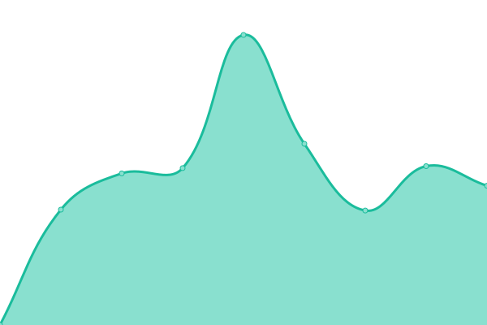
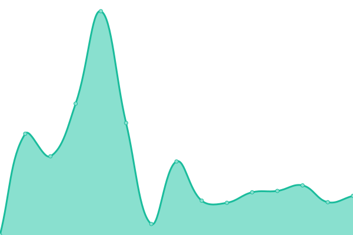

# [📈 Live Status](https://jogerj.github.io/ap-upptime): <!--live status--> **🟧 Partial outage**

This repository contains the open-source uptime monitor and status page for [jogerj](https://jogerj.github.io/ap-upptime), powered by [Upptime](https://github.com/upptime/upptime).

With [Upptime](https://upptime.js.org), you can get your own unlimited and free uptime monitor and status page, powered entirely by a GitHub repository. We use [Issues](https://github.com/jogerj/ap-upptime/issues) as incident reports, [Actions](https://github.com/jogerj/ap-upptime/actions) as uptime monitors, and [Pages](https://jogerj.github.io/ap-upptime) for the status page.

<!--start: status pages-->
<!-- This summary is generated by Upptime (https://github.com/upptime/upptime) -->
<!-- Do not edit this manually, your changes will be overwritten -->
<!-- prettier-ignore -->
| URL | Status | History | Response Time | Uptime |
| --- | ------ | ------- | ------------- | ------ |
|  Mail | 🟩 Up | [mail.yml](https://github.com/jogerj/ap-upptime/commits/HEAD/history/mail.yml) | 

 1637ms
     
 | 

<a href="https://jogerj.github.io/ap-upptime/history/mail">100.00%</a>
    

|  Mail Admin | 🟩 Up | [mail-admin.yml](https://github.com/jogerj/ap-upptime/commits/HEAD/history/mail-admin.yml) | 

 1608ms
     
 | 

<a href="https://jogerj.github.io/ap-upptime/history/mail-admin">100.00%</a>
    

|  APAJ Website | 🟥 Down | [apaj-website.yml](https://github.com/jogerj/ap-upptime/commits/HEAD/history/apaj-website.yml) | 

 7136ms
     
 | 

<a href="https://jogerj.github.io/ap-upptime/history/apaj-website">100.00%</a>
    

|  APKP Website | 🟥 Down | [apkp-website.yml](https://github.com/jogerj/ap-upptime/commits/HEAD/history/apkp-website.yml) | 

 2761ms
     
 | 

<a href="https://jogerj.github.io/ap-upptime/history/apkp-website">100.00%</a>
    

|  [TCP ping](1.1.1.1) | 🟩 Up | [tcp-ping.yml](https://github.com/jogerj/ap-upptime/commits/HEAD/history/tcp-ping.yml) | 

 81ms
     
 | 

<a href="https://jogerj.github.io/ap-upptime/history/tcp-ping">100.00%</a>
    

<!--end: status pages-->

[**Visit our status website →**](https://jogerj.github.io/ap-upptime)

## 📄 License

- Powered by: [Upptime](https://github.com/upptime/upptime)
- Code: [MIT](./LICENSE) © [jogerj](https://jogerj.github.io/ap-upptime)
- Data in the `./history` directory: [Open Database License](https://opendatacommons.org/licenses/odbl/1-0/)
